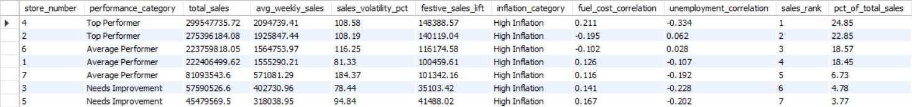

# Retail Sales Data Pipeline and Analysis
A robust data pipeline for processing and analyzing [Best Buy](https://www.kaggle.com/datasets/staykoks/best-buy-sales) retail sales datafrom Kaggle, featuring automated data cleaning, validation, database storage, and comprehensive sales analytics.

&nbsp;
## Overview
This project consists of two main components:
- A Python-based ETL (Extract, Transform, Load) pipeline that processes retail sales data
- A SQL analysis suite that generates detailed store performance metrics and economic impact analysis

&nbsp;
## Project Structure
```
retail-pipeline-analysis/
├── main.py               # Main ETL pipeline
├── analysis.sql          # SQL analysis queries
├── .env                  # Environment configuration
└── requirements.txt      # Python dependencies
```

&nbsp;
## Features
- Automated Data Pipeline
  - Environment variable configuration
  - Robust error handling and logging
  - Data validation and cleaning
  - Automated database schema creation
  - Kaggle dataset integration

- Comprehensive Analysis
  - Store performance classification
  - Seasonal sales impact analysis
  - Economic factor correlation
  - Store ranking and benchmarking
  - Sales volatility tracking
 
&nbsp;
## Prerequisites
- Python 3.8+
- MySQL Database
- Required Python packages
  - pandas
  - sqlalchemy
  - python-dotenv
  - kagglehub
  - mysql-connector-python

&nbsp;
## Installation
1. Clone this repository.
```
git clone https://github.com/johnfritzel/retail-pipeline-analysis.git
cd retail-pipeline-analysis
```

2. Create a virtual environment.
```
python -m venv venv
```

2. Activate the virtual environment.
```
venv\Scripts\activate # Windows
source venv/bin/activate  # Linux/macOS
```

4. Install required dependencies.
```
pip install -r requirements.txt
```

5. Create a .env file with the following variables:
```
DB_HOST=your_host
DB_USER=your_user
DB_PASSWORD=your_password
DB_NAME=your_database
DB_PORT=your_port
INPUT_FILE='C:\Users\<USERNAME>\.cache\kagglehub\datasets\staykoks\best-buy-sales\versions\1\BestBuySales.csv'
```

&nbsp;
## Usage
### Running the Pipeline
Execute the main pipeline script:
```
python main.py
```
The script will:
- Load and validate environment variables
- Download the dataset from Kaggle
- Clean and validate the data
- Load the processed data into the specified MySQL database

### Running the Analysis
Execute the SQL analysis script in your MySQL environment to generate comprehensive store performance metrics:
```
mysql -u your_user -p your_database < analysis.sql
```

## Output

The analysis generates detailed metrics including:
- Store performance classification (Top Performer, Average Performer, Needs Improvement)
- Total and average weekly sales
- Sales volatility percentages
- Festive period sales lift
- Economic impact correlations
- Store rankings
- Percentage of total company sales
